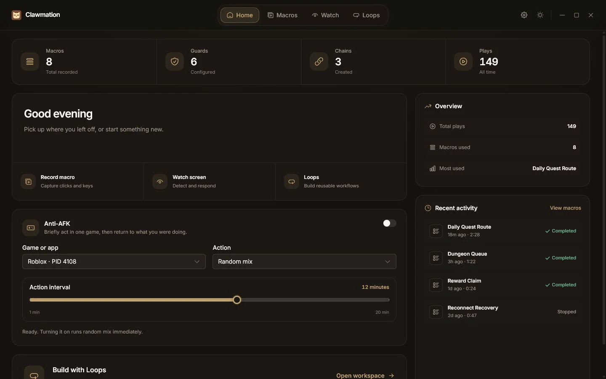
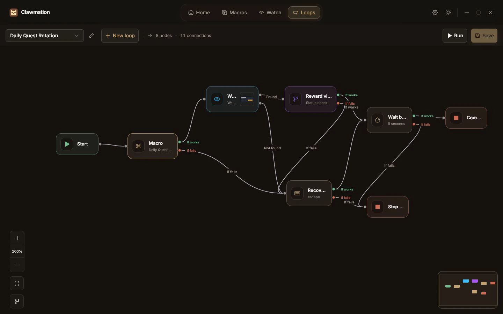
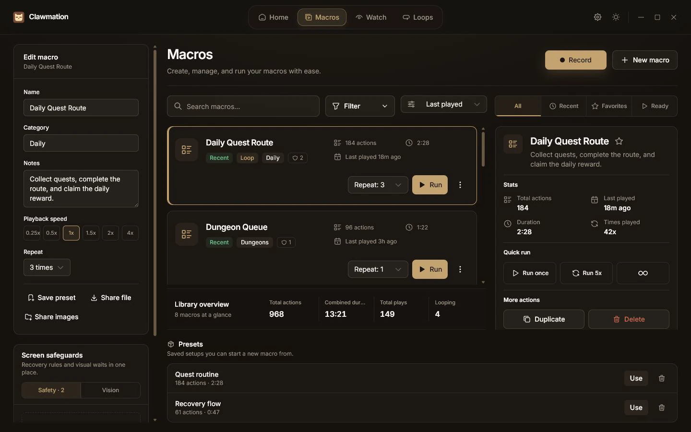
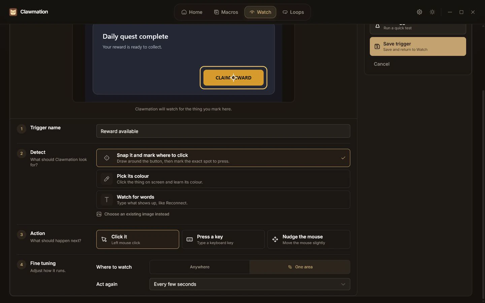

<div align="center">
  
  <h1>Clawmation</h1>
  <p>Windows macro recording, screen-aware playback, and visual automation workflows.</p>
  <p>
    <a href="https://github.com/faadingnightmaares/clawmation/releases/latest"></a>
    
    
  </p>
  <p>
    <a href="https://github.com/faadingnightmaares/clawmation/releases/download/v1.2.5/clawmation_1.2.5_x64-setup.exe"><strong>Download the Windows installer</strong></a>
    ·
    <a href="https://github.com/faadingnightmaares/clawmation/releases/latest">View the latest release</a>
  </p>
</div>

Clawmation is a local Windows 10 and 11 macro recorder and macro player for
games, including Roblox. It records mouse and keyboard input, replays editable
macros, detects screen changes with image matching, colour detection, pixel
detection, and OCR, and connects those actions through visual Loops. Download
the current installer above or review the source, architecture, and portable
file formats below.



## Capabilities

- **Macros:** record mouse and keyboard input, edit metadata and repeat rules,
  manage presets, run at different speeds, and export individual recordings.
- **Watch:** detect a saved image, colour, or text on screen, restrict detection
  to a region, and click, press a key, or move the pointer when it appears.
- **Loops:** connect recorded macros, waits, screen checks, branches, recovery
  actions, and stop conditions in a reusable visual workflow.
- **Safeguards:** attach recovery guards and vision checkpoints directly to a
  macro without changing the original recording.
- **Anti-AFK:** briefly activate a selected game window, perform a configured
  action, and return focus to the previous application.
- **Local operation:** macro data, screenshots, OCR, and image recognition stay
  on the computer. Clawmation has no account system, telemetry, or cloud
  processing.

## Visual workflows

Loops turn independent recordings and screen checks into directed workflows.
Each output is explicit, including **If works** and **If fails** paths, so error
recovery and stop conditions remain visible.



The example above embeds a snapshot of the `Daily Quest Route` macro, waits for
a reward image, branches on the result, runs a recovery path when required, and
finishes through explicit stop nodes. Embedded macros remain independent from
later edits to the source recording.

## Macro library

The Macros workspace keeps recording, filtering, playback controls, repeat
rules, presets, safeguards, notes, and run statistics in one view.



## Screen detection

Watch can respond without starting a macro. A trigger combines one visual
condition with one action, a confidence threshold, an optional screen region,
and a cooldown. Testing shows the captured frame and the detected target before
the trigger is armed.



## Portable file formats

Clawmation uses two versioned, compressed formats:

| Format | Contents | Use |
| --- | --- | --- |
| `.clawmation` | One macro | Share or archive a recording |
| `.clawbundle` | A macro or Loop plus every referenced vision image | Move a complete screen-aware automation setup |

Both formats use a manifest with declared sizes and BLAKE3 digests. JSON
payloads use Zstandard compression, duplicate images are stored once, and
imports reject traversal paths, unsafe names, undeclared files, invalid
digests, and excessive expanded sizes. Existing macros are never overwritten.
See [Portable file formats](docs/FILE-FORMATS.md) for the complete container and
compatibility contract.

## Privacy and network access

Recording, playback, screen capture, template matching, pixel detection, and
OCR run locally. Captured content is not uploaded. The application contacts
GitHub only to check the signed release manifest used by its updater.

## Requirements

- Windows 10 or Windows 11
- WebView2, included with Windows 11 and current Windows 10 installations
- A 64-bit Windows installation for the published installer

Development additionally requires Node.js 20 or newer, Rust stable with the
MSVC toolchain, and the Visual Studio Build Tools workload **Desktop
development with C++**.

## Installation

1. Download
   [`clawmation_1.2.5_x64-setup.exe`](https://github.com/faadingnightmaares/clawmation/releases/download/v1.2.5/clawmation_1.2.5_x64-setup.exe).
2. Run the installer.
3. Launch Clawmation and configure the record, play, and emergency-stop
   shortcuts in Settings.

The application checks the signed Tauri update manifest at launch. Release
assets and notes are available on the [Releases
page](https://github.com/faadingnightmaares/clawmation/releases).

## Development

Install the frontend dependencies:

```bash
npm install
```

Run the Tauri development application:

```bash
npm run tauri dev
```

Build the frontend:

```bash
npm run build
```

Build the Windows installers:

```bash
npm run tauri build
```

Release bundles are written under `src-tauri/target/release/bundle/`. Debug
builds store local data in the repository working directory; release builds
store portable data beside the executable.

## Tests

Run the frontend suite and TypeScript checks:

```bash
npm test
npx tsc --noEmit
```

Run the Rust suite:

```bash
cargo test --manifest-path src-tauri/Cargo.toml
```

Hardware tests that move the cursor, capture the live desktop, or display
native overlays are ignored by default. Run those individually on a machine
that is not in active use:

```bash
cargo test --manifest-path src-tauri/Cargo.toml --lib -- --ignored --test-threads=1
```

## Architecture

| Path | Responsibility |
| --- | --- |
| `src/` | React 19 and TypeScript interface, typed API seam, and view components |
| `src-tauri/src/commands/` | Validated Tauri command surface |
| `src-tauri/src/engine/` | Macro, Watch, guard, schedule, chain, and Loop execution |
| `src-tauri/src/hardware/` | DXGI capture, Win32 input, recording hooks, OCR, pickers, and vision |
| `src-tauri/src/models/` | Persistent configuration and file-format contracts |
| `src-tauri/src/shell/` | Tray, global hotkeys, updater, overlays, and indicator windows |

Read [Architecture](docs/ARCHITECTURE.md) for the dependency map and
[Design](docs/DESIGN.md) for the interface contract.

## Vision implementation

The vision layer is implemented in Rust without a Python or OpenCV runtime. It
contains native implementations of the image operations used by the detector,
including colour conversion, morphology, contours, resizing, CLAHE, Canny, and
masked template correlation. Matching uses a fast local search around the last
known location before broader multi-scale and edge-based passes.

## Contributing

Read [CONTRIBUTING.md](CONTRIBUTING.md) before opening a pull request. Changes
to detection, input synthesis, persistence, portable formats, or updater
behavior require focused regression coverage and a clear compatibility note.

## License

Clawmation is source-available, not open source. Personal, non-commercial use of
official binaries and private evaluation of the source are permitted under the
[Clawmation Source-Available License 1.0](LICENSE). Redistribution, commercial
use, hosted use, rebranding, derivative distribution, and machine-learning
training use are prohibited without prior written permission.

Versions previously released under the MIT License remain governed by the
license that accompanied those versions.
